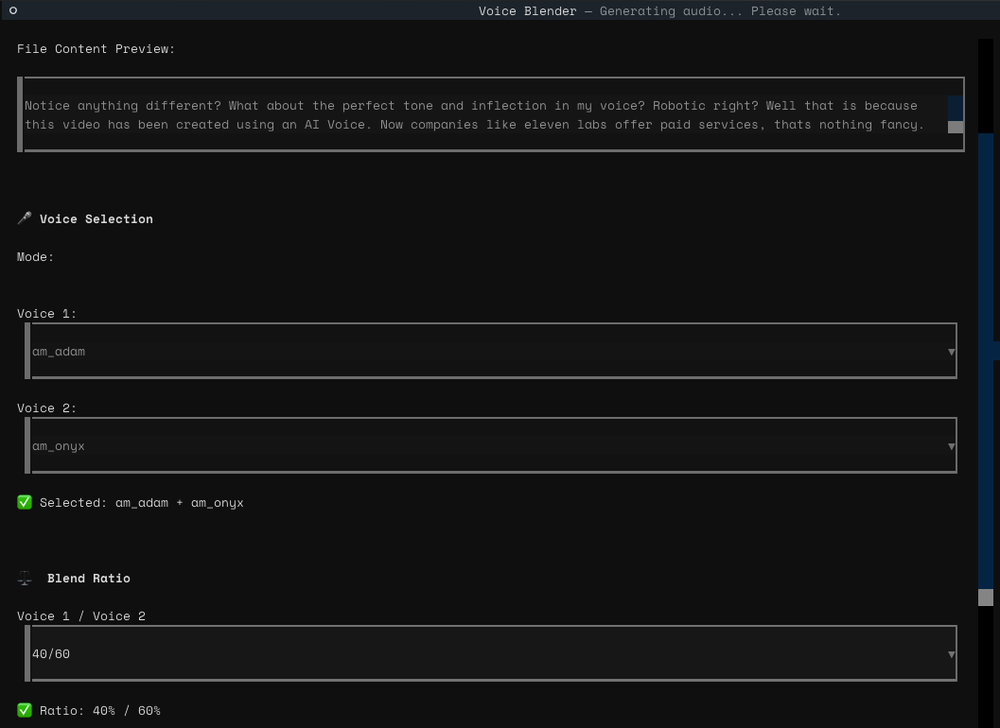
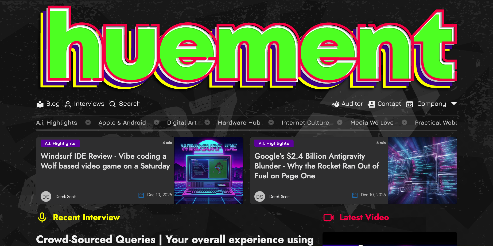

# 

<h1 align="center">🎙️ VoiceBlend-TUI</h1>
<p align="center">
  <i>A Textual-powered terminal UI for generating blended AI voices using kokoro-onnx — locally, privately, and for free.</i>
</p>

<p align="center">
  
  
  
  
  
</p>

---

## ✨ Overview

**VoiceBlend-TUI** is a command-line interface built with the **Textual** framework that lets you:

- Select a text file for narration
- Choose **one or two voices**
- Adjust the **blend ratio** (like 50/50, 70/30, 90/10)
- Automatically generate natural-sounding AI narration using **kokoro-onnx**
- Keep everything **local** and **offline**
- Save narration to a custom filename (with overwrite protection)

This tool is designed to be part of a real-world content-creation workflow involving:

- AI voiceover creation
- Adobe Character Animator puppeteering
- YouTube video production
- Batch narration workflows

---

## 🚀 Quick Start

You can run the entire app with **one command**:

```bash
./run.sh
```

The script will:

+ Check your Python version
+ Create a virtual environment (if missing)
+ Install dependencies
+ Launch the TUI

🛠️ Manual Setup
Requirements

Python 3.10 – 3.13

Git

macOS, Linux, or Windows (WSL recommended)

1. Create the environment

   ```
   python3.12 -m venv venv
   source venv/bin/activate   # Windows: venv\Scripts\activate
   ```
2. Install dependencies

   ```
   pip install -r requirements.txt
   pip install -e .
   ```

Or use the included installer:

```bash
./scripts/install.sh
```

3. Run the application

   ```bash
   python main.py
   ```

📁 Project Structure

```
voiceblend-tui/
│
├── src/voiceblend_tui/     # Main TUI application
├── voices/                 # ONNX models (downloaded on install)
├── data/                   # Sample text input files
├── scripts/                # install.sh / install.py / utility scripts
├── preview.png             # app preview (added by you)
└── blog-preview.png        # huement.com blog preview
```

🎨 Sponsored by Huement

This project is proudly sponsored by Huement — a place for original writing, videos, and tutorials covering:

* Tech & Internet Culture
* AI tools & workflows
* Art, Design, and Creativity
* Developer Tools
* Open-source workflows

👉 Visit the blog: [https://huement.com/blog](https://huement.com/blog)

👉 More videos & tutorials: featured throughout the articles

Thanks for supporting independent creative tech projects!

🖼️ Huement Blog Preview



📜 License

MIT License — free to use, modify, and integrate into your own workflow.
